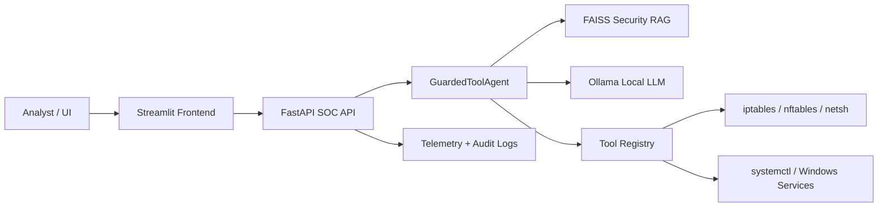

# Guardrailed AI SOC Agent

An enterprise-grade AI security operations platform that combines local LLM inference, log retrieval, and automated protective actions for SOC workflows. The system ingests analyst prompts, retrieves relevant telemetry from a FAISS-backed RAG store, decides whether a live security action is required, and then executes a controlled remediation against the host firewall or service manager.

## Architecture



## What this project does

- Uses a local LLM via Ollama (`llama3`) for decisioning and structured tool calls.
- Utilizes a FAISS-based retrieval layer over security logs for context-aware SOC analysis.
- Applies deterministic guardrails before any tool execution.
- Executes real operating-system actions such as IP blocking and service restarts.
- Exposes a REST API for agent queries, remediation requests, and telemetry.
- Provides a lightweight Streamlit dashboard for analyst interaction.

## SIEM / SOAR workflow

1. Analyst submits a security query through the dashboard or API.
2. The request is sanitized with a deterministic guardrail layer.
3. Relevant events are retrieved from the FAISS security log index.
4. The local Ollama model evaluates the request against retrieved context and emits a structured JSON tool call when needed.
5. The tool registry validates arguments and executes the relevant OS action.
6. The system returns a response, telemetry snapshot, and audit trail suitable for SOC operations.

## Project layout

- `agent.py` — LLM orchestration and structured tool decisioning.
- `tools.py` — Real OS remediation hooks and validation wrappers.
- `guardrails.py` — Input blocking and safety rules.
- `rag_engine.py` — FAISS retrieval engine for security logs.
- `main.py` — FastAPI backend for API access.
- `app.py` — Streamlit analyst frontend.
- `docker-compose.yml` — Compose deployment for UI, API, and local Ollama.

## Local development

```bash
python -m venv .venv
source .venv/bin/activate  # Windows: .venv\Scripts\activate
pip install -r requirements.txt
ollama serve
python main.py
```

Then open:

- API: http://localhost:8000/docs
- Dashboard: http://localhost:8501

## Docker deployment

```bash
docker compose up --build
```

This starts:

- `ollama` on port 11434
- `soc-engine` on port 8000
- `streamlit` on port 8501

## Security model

- Guardrails block destructive patterns and unsafe commands.
- The LLM is constrained to JSON tool-call output.
- Tool arguments are validated with Pydantic schemas before execution.
- OS actions are invoked only when the retrieved logs and user prompt justify the action.

## Production notes

This project is designed for local or private SOC deployments. For production use, add:

- authentication and role-based access control
- encrypted secret storage
- audit log persistence
- SIEM event ingestion from real log sources
- high-availability deployment with a managed database

## License

This project is intended for cybersecurity research, internal SOC automation, and private enterprise evaluation.
